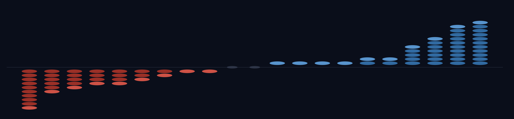
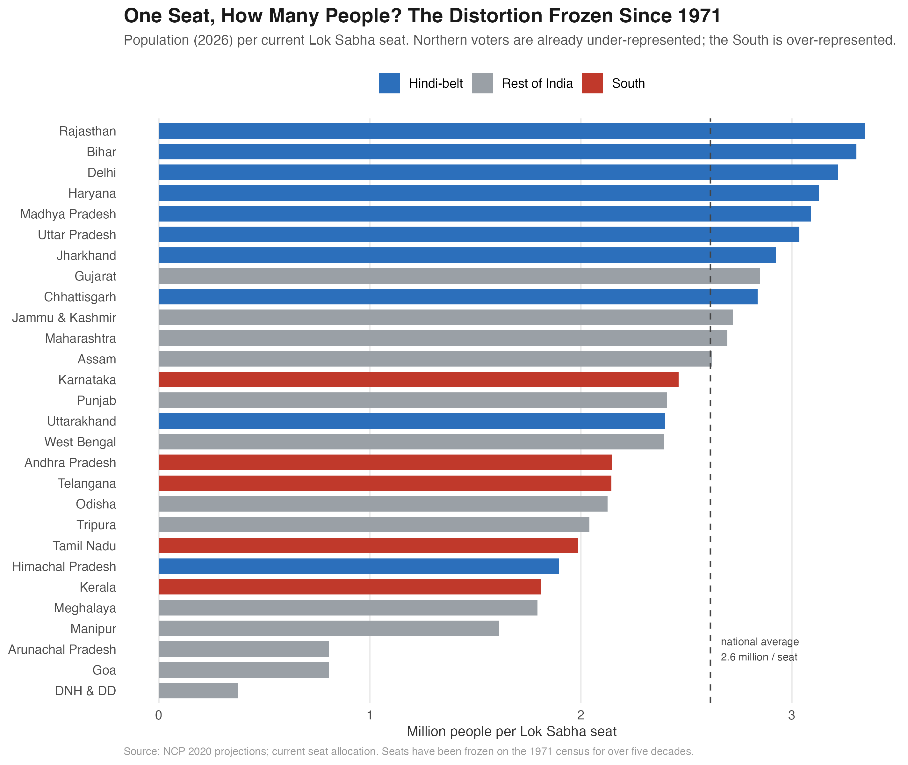
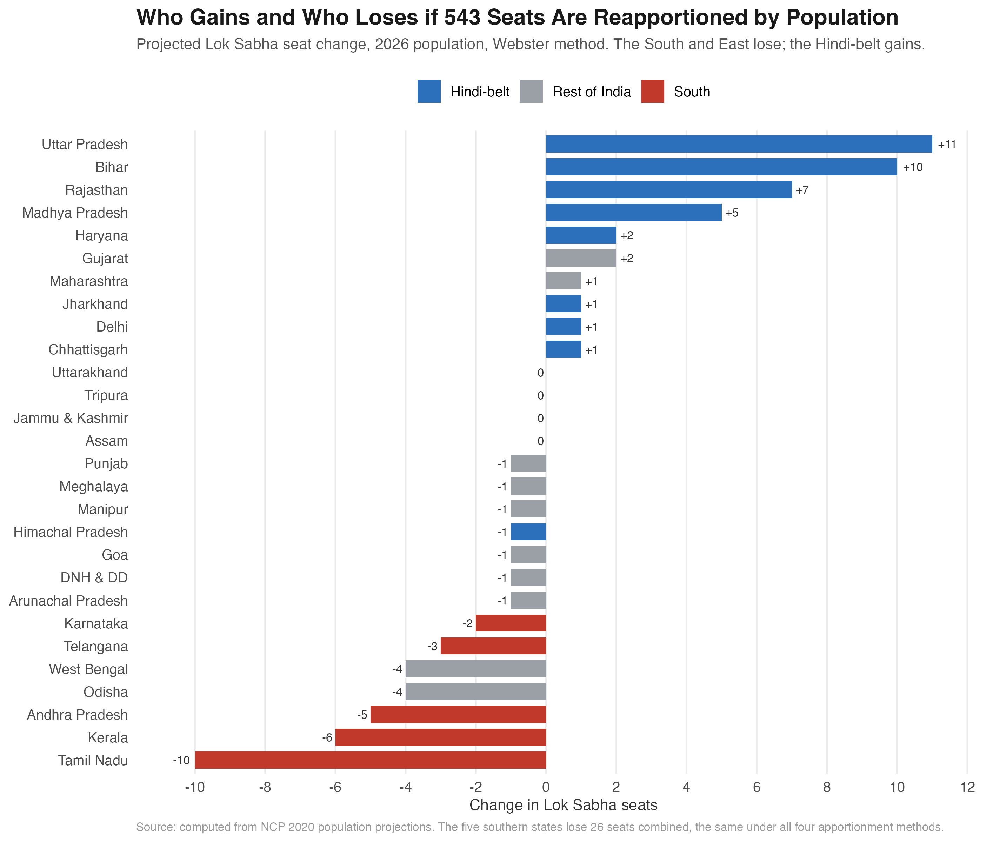
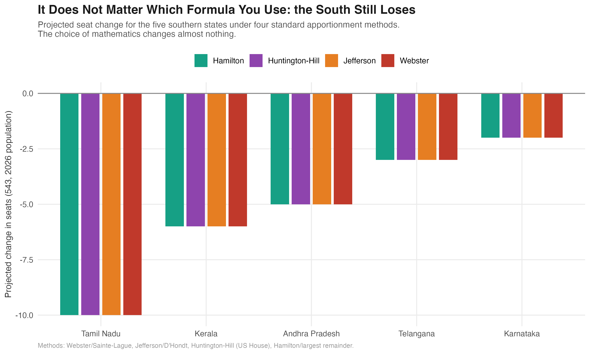
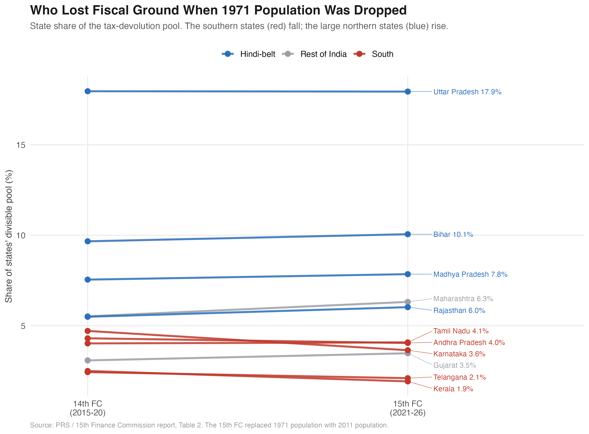

::: {.hero}
{.hero-img}

# India's Plan to Punish the States That Did Everything Right

::: {.subtitle}
If India redraws its parliamentary map by population, the states losing seats are the ones that cut their birth rates, schooled their daughters, and grew richer. The same states already lost money when the Finance Commission switched to a newer census. The penalty for governing well is double.
:::

::: {.meta}
Piyush Zaware · Northwestern Kellogg / University of Chicago
:::

::: {.badge-row}
::: {.badge-item}
543 Seats Frozen Since 1971
:::
::: {.badge-item .south}
South Loses 26
:::
::: {.badge-item}
UP +11 · Bihar +10
:::
::: {.badge-item}
r = −0.70
:::
::: {.badge-item}
4 Apportionment Methods
:::
:::
:::

::: {.lead-para}
Every dot in the image above is one Lok Sabha seat that would move if India reallocated its parliament by population. The red columns falling on the left are the southern and eastern states. The blue columns rising on the right are the Hindi-belt. The wave runs in one direction, and it is not random. The states on the losing side share something: they are the ones that did what national policy asked of them.
:::

::: {.abstract-box}
**Four findings from the data**

1. **The map is frozen on a 1971 photograph.** Lok Sabha seats have not been reallocated across states for over five decades. Each member of parliament now represents about 2.7 million people on average, the highest ratio in any democracy on earth.

2. **Reallocation by population shifts power north.** If the 543 seats were reapportioned on 2026 population, Uttar Pradesh would gain 11 seats and Bihar 10, while Tamil Nadu would lose 10 and Kerala 6. The five southern states lose 26 seats combined.

3. **The states losing seats are the ones that governed best.** Across the 21 major states, the correlation between a state's development record and its projected seat change is −0.70. Lower fertility, higher female literacy, and higher income all predict losing seats. Development explains nearly half the variation in who wins and loses.

4. **The penalty is double.** The same states that lose seats also lost fiscal share when the 15th Finance Commission switched from a 1971 to a 2011 population baseline. The five southern states give up roughly Rs 92,000 crore over 2021 to 2026, on top of 26 seats. The same demographic success is penalized twice, once in voice and once in money.
:::

```{=html}
<div class="stat-row">
  <div class="stat"><div class="stat-num red">−26</div><div class="stat-label">southern seats<br>(all four methods)</div></div>
  <div class="stat"><div class="stat-num red">₹92,000cr</div><div class="stat-label">southern fiscal loss<br>(15th Finance Commission)</div></div>
  <div class="stat"><div class="stat-num">−0.70</div><div class="stat-label">development vs<br>seat change</div></div>
  <div class="stat"><div class="stat-num">2.7M</div><div class="stat-label">people per MP<br>(highest on earth)</div></div>
</div>
```

## The Defeat That Froze the Map {#defeat}

In a special session in April 2026, the government introduced three bills to settle one of the most consequential questions in Indian federalism: how to redraw the boundaries and the seat counts of the Lok Sabha after half a century of freeze. The centerpiece, the Constitution (131st Amendment) Bill, would have expanded the house from 543 seats to 850. It needed a two-thirds majority. It did not get one. The bills lapsed within two days.

The defeat settled nothing. It only postponed the reckoning and left the existing map in place: a map drawn on the 1971 census, when India had roughly 548 million people. The country now has more than 1.4 billion. The freeze was meant to be temporary, a way to reassure states that controlled their populations that they would not lose parliamentary weight for doing so. That promise has been extended again and again. Each extension makes the eventual correction larger and more explosive.

This piece does not take a side on whether the freeze should end. It asks a narrower, answerable question: if India does reapportion by population, who gains, who loses, and what do the losers have in common?

## The Map Is a 1971 Photograph {#frozen}

Start with what the freeze has already produced. Because seats were fixed while populations kept changing, the number of people behind each seat now varies enormously from state to state.

{width=100%}

A voter in Rajasthan or Bihar today sits behind roughly 3.3 million people per seat. A voter in Kerala or Tamil Nadu sits behind closer to 1.8 million. That gap is not a plan or a policy. It is the mechanical residue of holding seats constant while some states grew faster than others. By the standard measure, about 8 percent of Lok Sabha representation is now misallocated relative to population, the equivalent of roughly 44 seats sitting in the wrong state.

This is the part both sides of the debate agree on. One person's vote should carry roughly the same weight as another's, and right now it does not. The disagreement begins when you ask how to fix it.

## Who Gains, Who Loses {#winners}

The simplest fix, and the principle written into the defeated amendment, is to reallocate the existing 543 seats so that every seat holds roughly the same number of people. Here is what that does.

{width=100%}

Uttar Pradesh gains 11 seats. Bihar gains 10. Rajasthan gains 7 and Madhya Pradesh 5. On the other side, Tamil Nadu loses 10, Kerala 6, Andhra Pradesh 5, West Bengal and Odisha 4 each. The five southern states together lose 26 seats. Forty-one seats move in total.

There is nothing dishonest in this reapportionment. It is exactly what "one person, one vote" requires. A Tamil voter and a Bihari voter would, after it, carry the same weight in Delhi. The problem is what the map looks like once you notice which states are on which side.

## The Performance Penalty {#penalty}

Here is the uncomfortable pattern. Sort the states not by region but by how they performed on the goals that national development policy has pursued for fifty years: lower fertility, female education, rising incomes. The states that did best are the states that lose seats.

{width=100%}

The relationship is steep and clean. A state's total fertility rate alone predicts its seat change with a correlation of +0.66: the more children per woman, the more seats it gains. Tamil Nadu and Kerala brought their fertility below replacement decades ago, ran some of India's best public health and schooling systems, and sit at the bottom of the chart. Uttar Pradesh and Bihar, with the highest fertility and the weakest human development indicators, sit at the top.

It is not only fertility. The same pattern holds for female literacy.

{width=100%}

Combine fertility, female literacy, and per-capita income into a single development index, and the correlation with seat change is **−0.70**. In a regression across the 21 major states, development explains 48 percent of the variation in seat change, and the relationship is significant at well below the one-in-a-thousand level. This is not a story about the South as a region. It is a story about performance. The states being asked to give up parliamentary voice are, almost exactly, the states that delivered what the country said it wanted.

::: {.callout-important}
**Why this is not just "the South complaining."** The southern states are over-represented today and a population-based correction would reduce that. That much is fair on its own terms. The deeper point is the incentive it sets. A state that lowers its fertility, educates its girls, and slows its population growth ends up with less national political power than a state that does none of those things. Whatever one thinks about the freeze, that is a strange thing for a country to reward.
:::

## It Is Not the Formula {#robustness}

One natural objection: maybe this is an artifact of the particular apportionment method. Countries use different rules to turn population into seats, and the choice can favor large or small states at the margin. So we ran the reapportionment four ways: Webster (the standard, also used in recent think-tank analyses), Jefferson, Huntington-Hill (the method the United States uses for its House), and Hamilton.

{width=100%}

The South loses the same 26 seats under all four. Tamil Nadu loses 10 in every method, Kerala 6, Andhra Pradesh 5. The reason is simple: the population gaps between states are so large that no reasonable rounding rule can bridge them. The result is driven by demography, not by the arithmetic chosen to express it.

## The Penalty Is Double: Seats and Money {#double}

### The same states lose at the Finance Commission too

So far this has been a story about seats. But parliamentary voice is not the only thing India allocates by population. Every five years the Finance Commission decides how the central tax pool is divided among the states, and in 2021 the Fifteenth Finance Commission changed its formula in exactly the way delimitation would: it dropped the 1971 population baseline and used the 2011 population instead. The effect was the same, and it fell on the same states.

{width=100%}

Put each state's seat change on one axis and its fiscal-share change on the other, and the southern states drop into the corner that loses both. Karnataka's devolution share fell by a full percentage point, from 4.71 to 3.65. Kerala's fell from 2.50 to 1.93. Andhra Pradesh and Telangana lost ground too. Across the five southern states the loss is about 2.2 percentage points of the divisible pool, which over the 2021 to 2026 award period works out to roughly **Rs 92,000 crore**.

The same demographic success that costs these states seats also costs them money. Both penalties run through one mechanism: the move from a 1971 population baseline to a 2011 one, which rewards the states that grew fastest.

{width=100%}

### One honest complication

The fiscal penalty is real, but it is softer than the seat penalty, and the reason matters. The Finance Commission formula has an equity component: through the "income distance" criterion it sends more to poorer states, and that cushion partly offsets the population effect. Delimitation has no such cushion. Seats are allocated on population alone. That is why Tamil Nadu, which loses 10 seats, actually gained a sliver of fiscal share. It is large, and by the income-distance measure it gets some protection that the seat formula does not offer.

The deeper point survives the complication. The instrument that allocates political power, seats, is pure population, and it punishes the South hardest. The instrument that allocates money, devolution, is population softened by equity, so it punishes the South less. But the direction is the same on both, and the same five states sit on the losing side of each.

## The Trap With No Clean Exit {#federalism}

If reapportioning by population punishes the states that governed best, why not just expand the house so nobody loses a seat? That was the logic of the defeated 850-seat bill. It is the most tempting option and the most quietly dishonest.

Expansion lets every state gain seats in absolute terms, which is why it is politically attractive. But share is what determines power, and in share terms expansion that preserves the current proportions simply freezes the 1971 distortion in a larger house. The South keeps its seats but watches its slice of a bigger pie shrink anyway, because the new seats are handed out in proportions set when India looked very different. Expansion does not resolve the tension. It hides it.

That is the trap. Every option on the table breaks something:

- **Reapportion by population** and you penalize the states that did what was asked, and you concentrate national power in the Hindi-belt.
- **Expand the house to protect seats** and you entrench a half-century-old distortion while pretending to fix it.
- **Keep the freeze** and the malapportionment festers, with each passing year making the eventual correction larger and the gap between a vote in Bihar and a vote in Kerala wider.

::: {.verdict-box}
**There is no formula that makes this fair.** The honest conclusion from the data is that delimitation in India is not a technical problem waiting for the right apportionment method. It is a values problem. The country has to decide what it is willing to trade between two principles it has long claimed to hold at once: that every vote should count equally, and that a federation should not punish its members for governing well. The April 2026 defeat did not resolve that choice. It deferred it.
:::

## The Data {#data}

The analysis rests on public, official sources, and the numbers reconcile against known totals.

| Source | What it provides |
|--------|------------------|
| Census of India 2011 | State populations (base year) |
| National Commission on Population (2020) | State population projections, 2026 and 2036 |
| Election Commission of India | Current Lok Sabha seat allocation (543) |
| NFHS-5 (2019-21) | Total fertility rate by state |
| Census 2011 | Female literacy by state |
| MOSPI / RBI | Per-capita state income (approximate) |
| PRS / 15th Finance Commission report | Tax-devolution shares, 14th and 15th FC |

The population figures were extracted directly from the National Commission on Population's 2020 report. As a check, the 36 state and union territory populations sum to 1.211 billion for 2011, matching the Census of India exactly, and Tamil Nadu's projected growth matches the figure the report itself states.

::: {.callout-important}
**These are projections, not certainties.** The 2026 and 2036 population figures are official projections made in 2020, before the delayed census. No actual delimitation has occurred or can occur until fresh census data exists. Everything here describes what reapportionment on the best available population estimates would do, not what will certainly happen.
:::

## Methods {#methods}

**Apportionment.** Seats are allocated to states by population under four standard methods, each implemented from first principles: Webster (Sainte-Lague), Jefferson (D'Hondt), Huntington-Hill (the US House method), and Hamilton (largest remainder). Every state is guaranteed at least one seat. The headline figures use Webster, the most widely used standard and the method behind recent independent analyses.

**The performance penalty.** Projected seat change is regressed on total fertility rate and on a composite development index, built from the z-scores of negative fertility, female literacy, and log per-capita income. The regression covers the 21 major states (current seats of four or more), so that the smallest union territories, which keep one seat mechanically, do not distort the relationship. The correlation between the development index and seat change is −0.70, significant at p = 0.0003, with an R-squared of 0.48.

**The double penalty.** Tax-devolution shares are the official inter-se shares from the 14th and 15th Finance Commissions (PRS, from the 15th FC report, Table 2). The rupee figure uses the 15th FC states' pool of about Rs 42.2 lakh crore over 2021 to 2026, so one percentage point of share is roughly Rs 42,200 crore. The seat penalty and the fiscal penalty move together (correlation +0.41). The development-fiscal correlation is weaker than the development-seat correlation, because the Finance Commission formula contains an equity (income-distance) component that partly cushions poorer states, while seat allocation does not.

A full series-by-series provenance audit is in the project repository. The compiled dataset and all code are available on request.

### Related reading

- Carnegie Endowment for International Peace, "Delimitation After Defeat: India's Unfinished Debate Over Representation" (2026), the most thorough recent analysis of the scenarios and the malapportionment math.
- National Commission on Population, *Population Projections for India and States 2011-2036* (2020).

---

## About

**Piyush Zaware** is a researcher at the Global Poverty Research Laboratory, Northwestern Kellogg School of Management, and a doctoral student in economics at the University of Chicago. He works on political economy, public finance, and state capacity in India.

[piyushz@uchicago.edu](mailto:piyushz@uchicago.edu)
